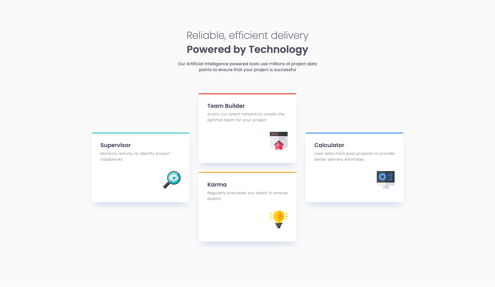

# Four Card Feature Section

A responsive feature section showcasing four cards in an elegant diamond-like layout. Built as part of the [Frontend Mentor](https://www.frontendmentor.io) Building Responsive Layouts learning path.

## 🎯 Overview

This project demonstrates a modern feature section highlighting four key capabilities: Supervisor, Team Builder, Karma, and Calculator. The layout adapts seamlessly from a single-column mobile view to a sophisticated diamond grid on desktop screens.

### Solution



### Links

- Solution URL: [GitHub Repository](https://github.com/hakan-kemal/four-card-feature-section)
- Live Site URL: [Netlify Deployment](https://four-card-feature-section-hk.netlify.app/)

## 🛠 My Process

### Built With

- **HTML5** - Semantic markup
- **CSS3** - Modern styling techniques
  - CSS Custom Properties (CSS Variables)
  - CSS Grid Layout
  - Flexbox Layout
  - Mobile-first workflow
- **Google Fonts** - [Poppins](https://fonts.google.com/specimen/Poppins)

### What I Learned

This project reinforced several key concepts:

**Advanced CSS Grid Layouts**: Created a diamond pattern layout using CSS Grid with precise positioning:

```css
.features {
  display: grid;
  grid-template-columns: repeat(3, 1fr);
  grid-template-rows: repeat(4, auto);
  gap: 1.875rem;
}

.supervisor {
  grid-column: 1 / 2;
  grid-row: 2 / 4;
}
```

**CSS Custom Properties**: Organized design tokens using CSS variables for maintainability:

```css
:root {
  --color-red: hsl(0, 78%, 62%);
  --color-cyan: hsl(180, 62%, 55%);
  --color-orange: hsl(34, 97%, 64%);
  --color-blue: hsl(212, 86%, 64%);
}
```

**Color-coded Cards**: Applied subtle top borders to differentiate each feature:

```css
.supervisor {
  border-top: 0.25rem solid var(--color-cyan);
}

.team-builder {
  border-top: 0.25rem solid var(--color-red);
}
```

**Responsive Design**: Implemented mobile-first approach with seamless breakpoints:

```css
@media (min-width: 48rem) {
  .features {
    display: grid;
    grid-template-columns: repeat(3, 1fr);
  }
}
```

### Continued Development

Areas I want to focus on in future projects:

- Mastering more complex CSS Grid patterns and asymmetric layouts
- Exploring CSS subgrid for nested grid layouts
- Learning JavaScript fundamentals to add interactivity
- Implementing CSS animations for card hover effects
- Deepening accessibility knowledge with ARIA patterns

### Useful Resources

- [MDN Web Docs - CSS Grid Layout](https://developer.mozilla.org/en-US/docs/Web/CSS/CSS_grid_layout) - Comprehensive guide on CSS Grid
- [CSS-Tricks - A Complete Guide to Grid](https://css-tricks.com/snippets/css/complete-guide-grid/) - Excellent visual reference for Grid properties
- [web.dev - CSS Custom Properties](https://web.dev/learn/css/custom-properties) - Understanding CSS variables

## 👤 Author

- Frontend Mentor - [@hakan-kemal](https://www.frontendmentor.io/profile/hakan-kemal)
- GitHub - [@hakan-kemal](https://github.com/hakan-kemal)

## 🙏 Acknowledgments

Thanks to Frontend Mentor for providing this challenge and the design specifications.
